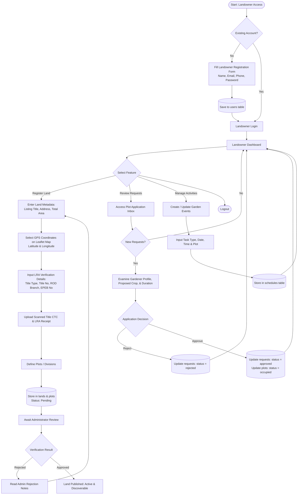
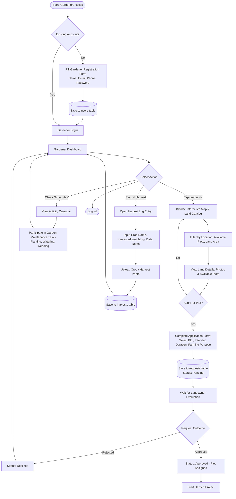
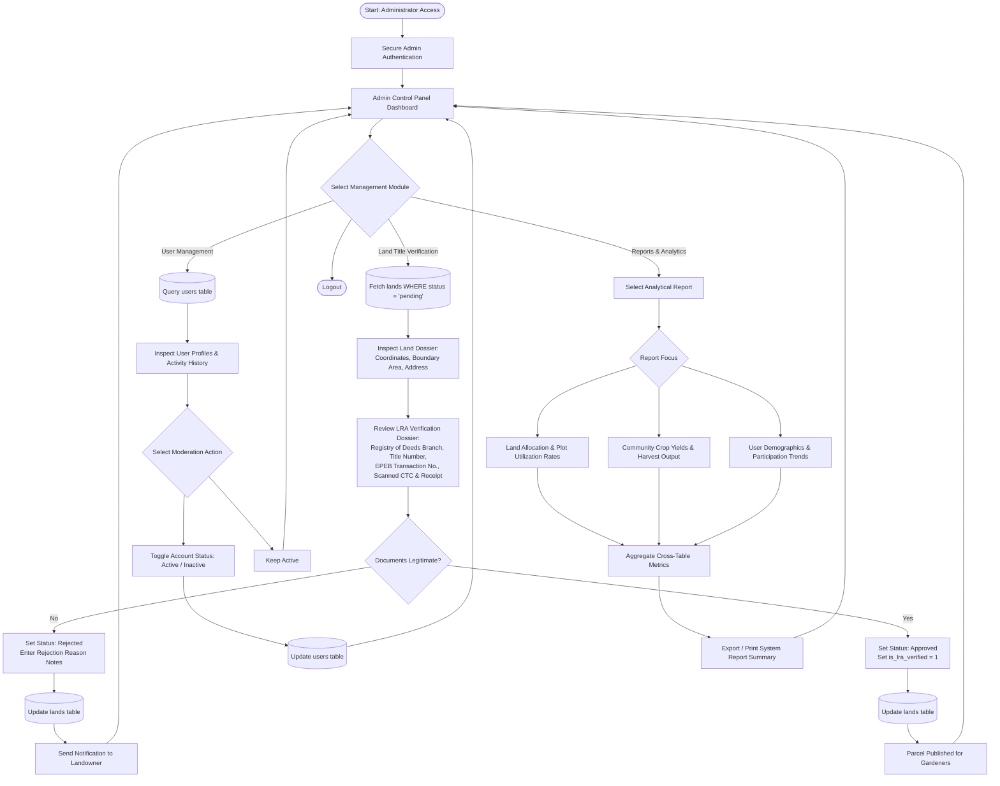

# 3.2 System Process Flow

The **System Process Flow** illustrates how information moves across the **Idle Land for Community Gardening System**. It defines how data is captured, verified, shared, and updated among the three primary system actors: **Landowner**, **Gardener**, and **Administrator**.

---

## 3.2.1 High-Level Information Movement

The system operates around a central relational database ensuring verified, secure data handoffs:
1. **Land Onboarding & Legal Verification**: Landowners register parcel details and upload Land Registration Authority (LRA) verification documents (TCT/OCT, EPEB reference number, scanned deed). The Administrator audits the documents, verifying legitimacy before making the parcel publicly visible.
2. **Plot Application & Allocation**: Gardeners search verified lands via an interactive OpenStreetMap/Leaflet interface, inspect available sub-plots, and submit farming proposals. Landowners review incoming requests and approve or decline them, automatically updating plot occupancy.
3. **Collaboration & Harvest Tracking**: Approved gardeners and landowners collaborate through calendar schedules for community tasks (planting, watering, weeding). When crops mature, gardeners document their harvest yields (weight in kg, crop type, photos) for monitoring agricultural productivity.
4. **Governance & Analytics**: System administrators monitor platform activity, audit user accounts, and generate comprehensive utilization and yield reports.

### Diagram Artifacts Available
- **Full Detailed Vector Diagrams**: [flowchart_landowner.svg](file:///c:/xampp1/htdocs/garden/docs/flowchart_landowner.svg), [flowchart_gardener.svg](file:///c:/xampp1/htdocs/garden/docs/flowchart_gardener.svg), [flowchart_admin.svg](file:///c:/xampp1/htdocs/garden/docs/flowchart_admin.svg)
- **Simple Line Drawing Versions (Academic / Print Style)**: [simple_drawing_overview.svg](file:///c:/xampp1/htdocs/garden/docs/simple_drawing_overview.svg), [simple_drawing_landowner.svg](file:///c:/xampp1/htdocs/garden/docs/simple_drawing_landowner.svg), [simple_drawing_gardener.svg](file:///c:/xampp1/htdocs/garden/docs/simple_drawing_gardener.svg), [simple_drawing_admin.svg](file:///c:/xampp1/htdocs/garden/docs/simple_drawing_admin.svg)
- **Interactive Web & Print Viewer**: [system_process_flow.html](file:///c:/xampp1/htdocs/garden/docs/system_process_flow.html)

---

## 3.2.2 Landowner Process Flow

---

## 3.2.3 Gardener Process Flow

---

## 3.2.4 Administrator Process Flow

---

## 3.2.5 Data Entity Handoff Matrix

| Stage | Triggering Actor | Data Transmitted | Receiving Component | Impact on System State |
| :--- | :--- | :--- | :--- | :--- |
| **Land Registration** | Landowner | Title, Geo-coordinates, Area, Title Type, EPEB No, Scans | Admin Queue (`lands`) | New record with `status = 'pending'`, `is_lra_verified = 0` |
| **Verification Review** | Administrator | Approval or Rejection status + feedback | Landowner / Public Listing | `status = 'approved'`, `is_lra_verified = 1`; plots open for search |
| **Plot Request** | Gardener | Plot ID, Garden plan, Duration | Landowner Inbox (`requests`) | New request record with `status = 'pending'` |
| **Plot Decision** | Landowner | Approval or Rejection response | Gardener Notification / Plot | `requests.status = 'approved'`, `plots.status = 'occupied'` |
| **Task Scheduling** | Landowner / Gardener | Task title, category, date/time range | Calendar System (`schedules`) | Shared calendar entry displayed on dashboard |
| **Harvest Recording** | Gardener | Crop type, quantity (kg), photo, date | Harvest Registry (`harvests`) | Appended to community agricultural yield tracking |
| **System Reporting** | Administrator | Date filters, category parameters | Reporting Engine | Real-time aggregate SQL statistics & visual chart outputs |
